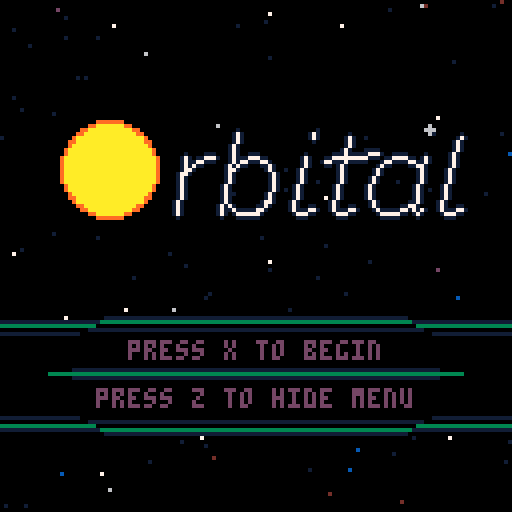

# Orbital

A Newtonian gravity-based orbital mechanics sim space exploration game for the [Pico-8](https://www.lexaloffle.com/pico-8.php).

### Features:

- Procedurally generated cluster of 24 stars, each with 1-4 planets. Rather than utilizing the Map feature of Pico-8, which supports a pre-drawn map of 1024x512 pixels, this cluster utilizes the full range of possible values in Pico-8, generating a map that is 65,536x65,536 pixels in size, giving large interstellar spaces to navigate.
- Procedurally generated unique, persistant planet surfaces. 60+ planetary surfaces, each 32,768 pixels long, with "natural" undulations and elevation changes are generated for exploration, with gravity values based on planetary mass. Seed-based generation unique to each save game means virtually infinite possible worlds!
- Mysterious ancient artifacts to discover. Learn the secrets of an ancient alien civilization that mysteriously disappeared long ago.
- Each discovered artifact increases your ship's abilities, allowing easier, faster exploration.
- Vector-based sprites for full rotation.
- Save/Load capability.
- No enemies, no time limit. Free exploration.